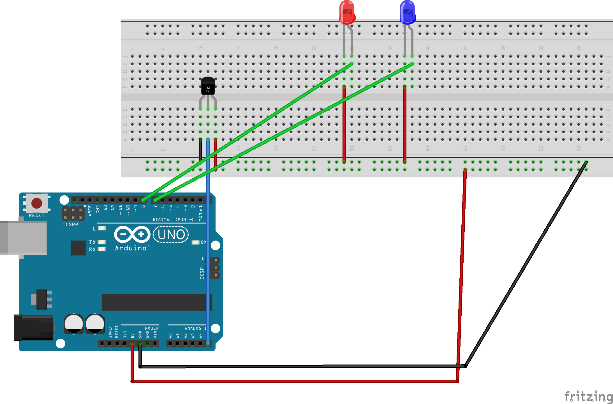

### LM35 temperature sensor

Measure temperature using LM35 sensor and output it to monitor log. Red light shows if temperature is more than 10 degrees, and blue light is on if temp is 10 or less degrees.

    

