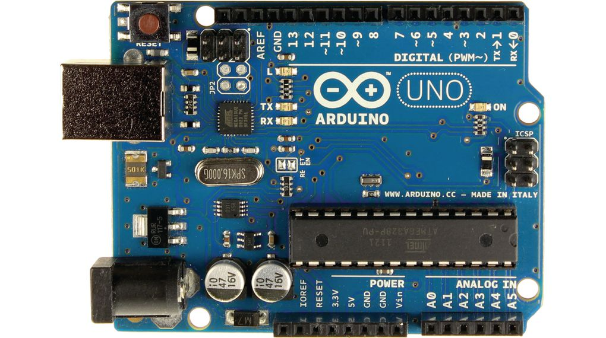

## Mini things I've built while playing with arduino

#### Arduino Uno

<div>
    
    <br/>
</div>

**14 Digital INPUT/OUTPUT pins (pins 0-13)**

Pins can be set as inputs or outputs. They are specified by the sketch

**6 Analogue IN pins (A0 - A5)**

Analogue pins take analogue values (voltage readings from a sensor) and convert thme into a number between 0 and 1023

**6 Analogue OUT pins (3, 5, 6, 9, 10, 11)**

These are digital pins then can be reprogrammed for analogue output using sketch.

### Code

* Each arduino program **must** have

```c#
void setup() {
    // setup code
}

void loop() {
    // running code
}

```

```c#

pinMode(pin, mode);         // pin - pin num on arduino board; mode - OUTPUT or INPUT


digitalWrite(pin, mode);     // turns pin on or off (pin must be set as OUTPUT). HIGH/LOW
delay(ms);                  // delay action

```